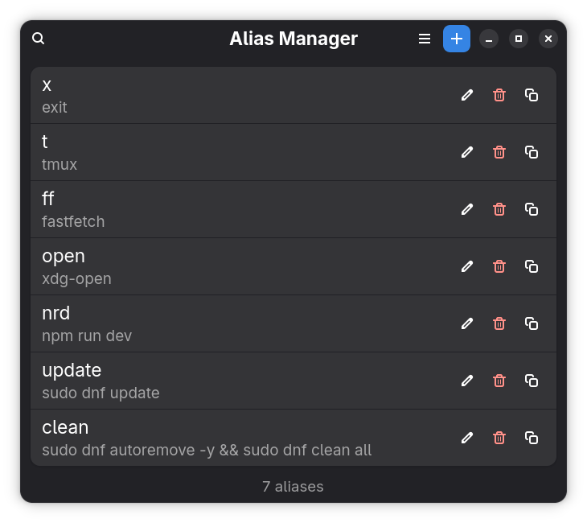
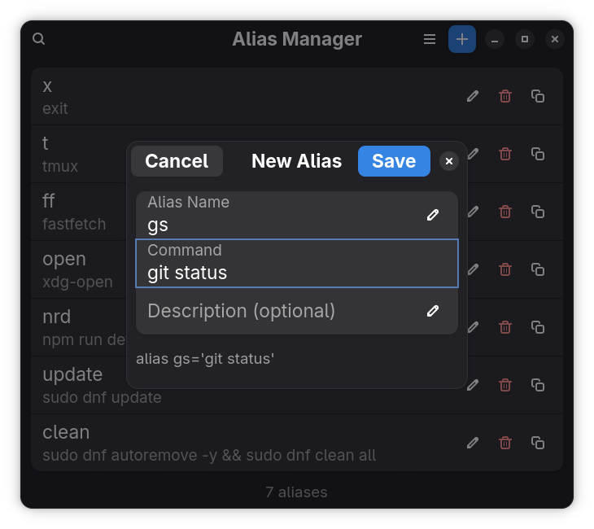

<div align="center">
  

  # Alias Manager

  A native GNOME app to manage your `~/.bashrc` aliases visually.
  Built with GTK4 + libadwaita + Python.
</div>

## Features

- Live sync with `~/.bashrc` — the alias list updates instantly when the file changes
- Add, edit, and delete aliases with a clean dialog
- Bulk delete — select multiple aliases and remove them at once
- Alias suggestions based on your shell history — frequently used commands are surfaced automatically
- Non-destructive — a timestamped backup of `~/.bashrc` is created before every write
- Search across alias names, commands, and descriptions in real time
- Keyboard shortcuts — `Ctrl+N` to add, `Ctrl+F` to search
- Preserves your `~/.bashrc` order and works with manually written aliases too
- Native GNOME look and feel with libadwaita and dark mode support

## Install

Install from Flathub, or build manually:

```bash
git clone https://github.com/aayamrajshakya/aliasmanager
cd aliasmanager
meson setup builddir --prefix=$HOME/.local
cd builddir
meson install
```

Then launch via your application menu, or:
```bash
flatpak run io.github.aayamrajshakya.aliasmanager
```

## How it works

- Reads all `alias name='command'` lines from `~/.bashrc` on launch
- Watches `~/.bashrc` for changes and reloads automatically
- Aliases added or edited by this app are tagged with `# [alias-manager]` for tracking
- A timestamped `.bak` file is stored in `~/.local/share/io.github.aayamrajshakya.aliasmanager/` before every write operation

> [!TIP]
> New terminal windows pick up alias changes automatically. To apply them in an already open terminal, run `source ~/.bashrc`.

## Screenshots

<div align="center">
  
  <p><em>All your aliases in one place, with smart suggestions from your shell history</em></p>

  <br>

  
  <p><em>Add or edit aliases with live preview and duplicate detection</em></p>

  <br>

</div>

## Contributing

Feel free to open an issue or submit a pull request. All contributions are welcome.
