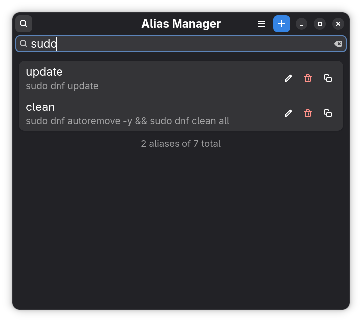

<div align="center">
  

  # Alias Manager

  A native GNOME app to manage your `~/.bashrc` aliases visually.
  Built with GTK4 + libadwaita + Python.
</div>

## Features

- Live sync with `~/.bashrc` — the alias list updates instantly when the file changes
- Full CRUD — add, edit, and delete aliases with a clean dialog
- Non-destructive — a timestamped backup of `~/.bashrc` is created before every write
- Search across alias names, commands, and descriptions in real time
- Preserves your `~/.bashrc` order and works with manually written aliases too
- Native GNOME look and feel with libadwaita and dark mode support

## Requirements

```bash
# Fedora
sudo dnf install python3-gobject

# Ubuntu/Debian
sudo apt install python3-gi python3-gi-cairo
```

## Install

```bash
meson setup builddir --prefix=$HOME/.local
cd builddir
meson install
```

Then launch with:
```bash
alias-manager
```

## How it works

- Reads all `alias name='command'` lines from `~/.bashrc` on launch
- Watches `~/.bashrc` for changes and reloads automatically
- Aliases added or edited by this app are tagged with `# [alias-manager]` for tracking
- A timestamped `.bak` file is created before every write operation

## Notes

- After adding or editing aliases, run `source ~/.bashrc` in your terminal for changes to take effect in existing sessions
- New terminal windows will pick up changes automatically

## Screenshots

<div align="center">
  
  <p><em>All your aliases in one place, in the order they appear in <code>~/.bashrc</code></em></p>

  <br>

  
  <p><em>Add or edit aliases with live preview and duplicate detection</em></p>

  <br>

  
  <p><em>Search across names, commands, and descriptions instantly</em></p>
</div>

## Contributing

Feel free to open an issue or submit a pull request. All contributions are welcome.
